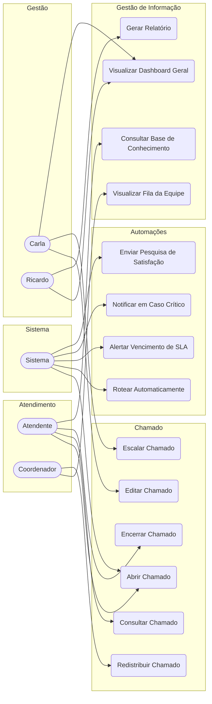

# Diagrama de Casos de Uso — Central de Atendimento

```mermaid
graph LR
    subgraph Atendimento
        atendente([Atendente])
        coordenador([Coordenador])
    end

    subgraph Gestão
        carla([Carla])
        ricardo([Ricardo])
    end

    subgraph Sistema
        sistema([Sistema])
    end

    subgraph Chamado
        abrirChamado(Abrir Chamado)
        consultarChamado(Consultar Chamado)
        encerrarChamado(Encerrar Chamado)
        editarChamado(Editar Chamado)
        escalarChamado(Escalar Chamado)
        redistribuirChamado(Redistribuir Chamado)
    end

    subgraph Automações
        rotearChamado(Rotear Automaticamente)
        alertarSLA(Alertar Vencimento de SLA)
        notificarRicardo(Notificar em Caso Crítico)
        enviarPesquisa(Enviar Pesquisa de Satisfação)
    end

    subgraph Gestão de Informação
        visualizarFila(Visualizar Fila da Equipe)
        visualizarDashboard(Visualizar Dashboard Geral)
        gerarRelatorio(Gerar Relatório)
        consultarBaseConhecimento(Consultar Base de Conhecimento)
    end

    atendente --> abrirChamado
    atendente --> consultarChamado
    atendente --> encerrarChamado
    atendente --> consultarBaseConhecimento

    coordenador --> visualizarFila
    coordenador --> redistribuirChamado

    carla --> editarChamado
    carla --> escalarChamado
    carla --> visualizarDashboard

    ricardo --> visualizarDashboard
    ricardo --> gerarRelatorio

    sistema --> abrirChamado
    sistema --> rotearChamado
    sistema --> alertarSLA
    sistema --> notificarRicardo
    sistema --> enviarPesquisa
```
